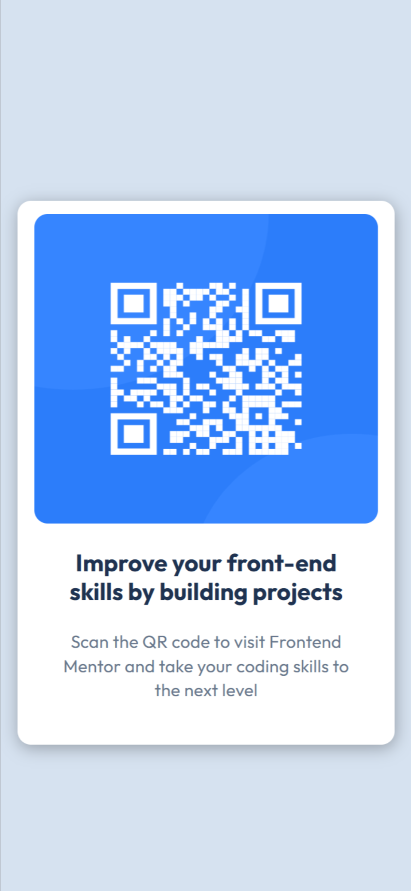
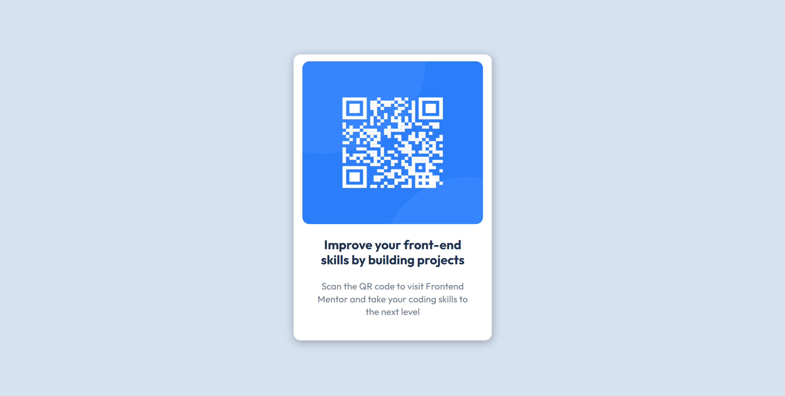

# Frontend Mentor - QR code component solution

This is a solution to the [QR code component challenge on Frontend Mentor](https://www.frontendmentor.io/challenges/qr-code-component-iux_sIO_H). Frontend Mentor challenges help you improve your coding skills by building realistic projects. 

## Table of contents

- [Overview](#overview)
  - [Screenshot](#screenshot)
  - [Links](#links)
  - [Built with](#built-with)
  - [What I learned](#what-i-learned)
  - [Continued development](#continued-development)
- [Author](#author)


## Overview
Hello I am Aachal and i completed the QR code design uding HTML and CSS.

### Screenshot


### Mobile Deign


### Desktop Design



### Links

- Solution URL: [Add solution URL here](https://your-solution-url.com)
- Live Site URL: [Add live site URL here](https://your-live-site-url.com)


### Built with

- Semantic HTML5 markup
- Flexbox
- Min,Max Width and Height

### What I learned

I got to practiced the flexbox in this also the new thing i learned is giving a container 100% width while also giving it max-width whatever we want. This hekped me in making it responsive.

```css
main{
  width: 100%;
    max-width: 450px;
}
```


### Continued development

I want to focus more on responsive layouts and making more websites using JS too.I want to work more on my flexbox and grid layouts also on responsive width and heights.


## Author

- Website - [Add your name here](https://www.your-site.com)
- Frontend Mentor - [@yourusername](https://www.frontendmentor.io/profile/yourusername)

