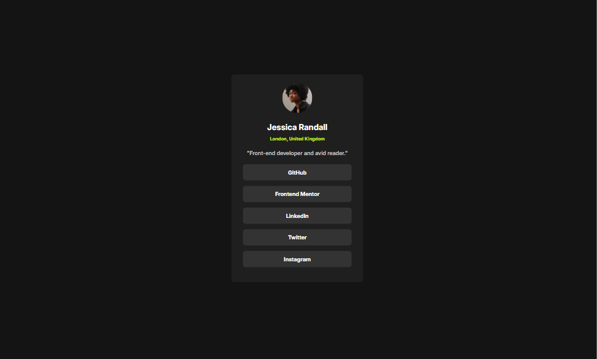
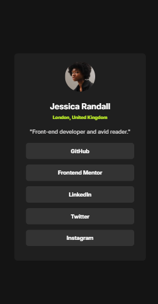

# Frontend Mentor - Social links profile solution

This is a solution to the [Social links profile challenge on Frontend Mentor](https://www.frontendmentor.io/challenges/social-links-profile-UG32l9m6dQ). Frontend Mentor challenges help you improve your coding skills by building realistic projects. 

## Table of contents

- [Overview](#overview)
  - [Screenshot](#screenshot)
  - [Links](#links)
- [Author](#author)

## Overview
Social Links Profile using HTML and CSS

### Screenshot

### Links

- Solution URL: https://github.com/aagah20/frontendMentor-Projects/tree/main/Social%20Links%20Profile/socialLinksProfile
- Live Site URL: [Add live site URL here](https://your-live-site-url.com)

## Author

- Website - [Add your name here](https://www.your-site.com)
- Frontend Mentor - https://www.frontendmentor.io/profile/aagah20

