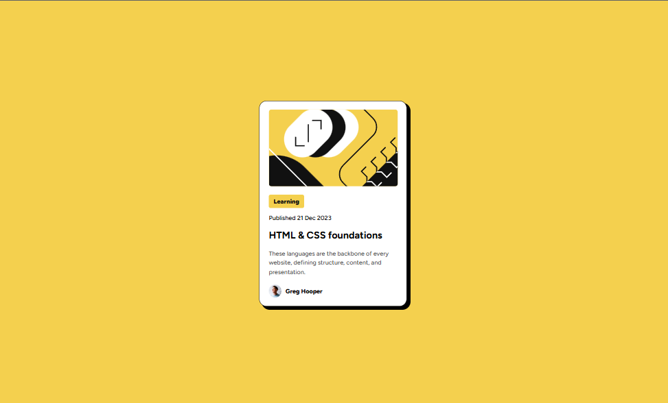
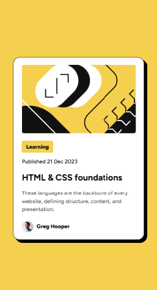

# Frontend Mentor - Blog preview card solution

This is a solution to the [Blog preview card challenge on Frontend Mentor](https://www.frontendmentor.io/challenges/blog-preview-card-ckPaj01IcS). Frontend Mentor challenges help you improve your coding skills by building realistic projects. 

## Table of contents

- [Overview](#overview)
  - [Screenshot](#screenshot)
  - [Links](#links)
  - [Built with](#built-with)
- [Author](#author)

## Overview
Blog Card using HTML and CSS.

### Screenshot

 #### Desktop Image

 #### Mobile Image

### Links

- Solution URL: https://github.com/aagah20/frontendMentor-Projects/tree/main/blogCard
- Live Site URL: https://frontend-mentor-projects-xfa6.vercel.app

### Built with

- Semantic HTML5 markup
- CSS custom properties
- Flexbox

## Author

- Frontend Mentor - https://www.frontendmentor.io/profile/aagah20

